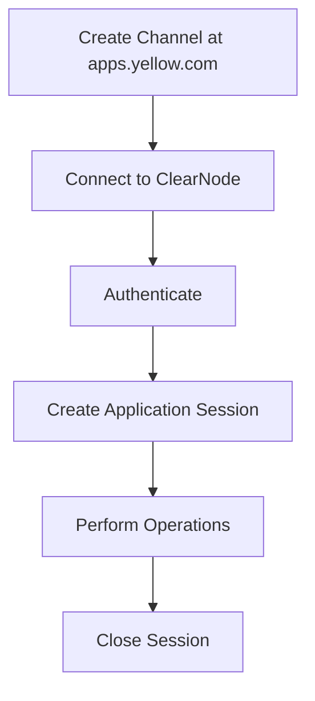

# Yellow Protocol Quick Start Reference

## Overview

Yellow implements ERC7824 state channels protocol using the Nitrolite SDK. This reference provides essential patterns and examples for building applications.

## Installation

```bash
npm install @erc7824/nitrolite
# or
yarn add @erc7824/nitrolite
# or
pnpm add @erc7824/nitrolite
```

## Core Workflow



## ClearNode Configuration

- **Production WebSocket URL**: `wss://clearnet.yellow.com/ws`
- **Protocol**: NitroliteRPC over WebSocket
- **Authentication**: EIP-712 signature-based

## Essential Imports

```javascript
import {
  // Authentication
  createAuthRequestMessage,
  createAuthVerifyMessage,
  createAuthVerifyMessageWithJWT,
  createEIP712AuthMessageSigner,

  // Session Management
  createAppSessionMessage,
  createCloseAppSessionMessage,

  // Data Retrieval
  createGetChannelsMessage,
  createGetLedgerBalancesMessage,
  createGetConfigMessage,

  // Utilities
  parseRPCResponse,
  RPCMethod,
  generateRequestId,
  getCurrentTimestamp,

  // Types
  MessageSigner,
  RequestData,
  ResponsePayload,
} from '@erc7824/nitrolite';
```

## Message Signer Pattern

### Standard Pattern (for non-auth messages)

```javascript
import { ethers } from 'ethers';
import { Hex } from 'viem';

const messageSigner = async (payload) => {
  try {
    const wallet = new ethers.Wallet('0xYourPrivateKey');
    const messageBytes = ethers.utils.arrayify(
      ethers.utils.id(JSON.stringify(payload))
    );
    const flatSignature = await wallet._signingKey().signDigest(messageBytes);
    const signature = ethers.utils.joinSignature(flatSignature);
    return signature;
  } catch (error) {
    console.error('Error signing message:', error);
    throw error;
  }
};
```

### Session Key Pattern (Recommended for Production)

```javascript
// Generate temporary session key
const sessionWallet = ethers.Wallet.createRandom();

const messageSigner = async (payload) => {
  try {
    const message = JSON.stringify(payload);
    const digestHex = ethers.id(message);
    const messageBytes = ethers.getBytes(digestHex);
    const { serialized: signature } = sessionWallet.signingKey.sign(messageBytes);
    return signature;
  } catch (error) {
    console.error('Error signing message:', error);
    throw error;
  }
};
```

## Authentication Flow

### Initial Authentication

```javascript
// Step 1: Send auth_request
const authRequestMsg = await createAuthRequestMessage({
  address: '0xYourWalletAddress',
  session_key: '0xSessionKeyAddress',
  application: 'YourAppDomain',
  expires_at: (Math.floor(Date.now() / 1000) + 3600).toString(),
  scope: 'console',
  allowances: [],
});

ws.send(authRequestMsg);

// Step 2: Handle auth_challenge
ws.onmessage = async (event) => {
  const message = parseRPCResponse(event.data);

  if (message.method === RPCMethod.AuthChallenge) {
    // Create EIP-712 signer
    const eip712MessageSigner = createEIP712AuthMessageSigner(
      walletClient,
      {
        scope: 'console',
        application: 'YourAppDomain',
        participant: '0xYourWalletAddress',
        expires_at: authRequestMsg.expires_at,
        allowances: [],
      },
      { name: 'Your Domain' }
    );

    // Step 3: Send auth_verify
    const authVerifyMsg = await createAuthVerifyMessage(
      eip712MessageSigner,
      message
    );

    ws.send(authVerifyMsg);
  }

  // Step 4: Handle auth_success
  if (message.method === RPCMethod.AuthVerify && message.params.success) {
    console.log('Authentication successful');
    localStorage.setItem('clearnode_jwt', message.params.jwtToken);
  }
};
```

### Reconnection with JWT

```javascript
const jwtToken = localStorage.getItem('clearnode_jwt');

if (jwtToken) {
  const authMsg = await createAuthVerifyMessageWithJWT(jwtToken);
  ws.send(authMsg);
}
```

## Application Session Management

### Create Session

```javascript
const appDefinition = {
  protocol: 'nitroliterpc',
  participants: [participantA, participantB],
  weights: [100, 0],
  quorum: 100,
  challenge: 0,
  nonce: Date.now(),
};

const allocations = [
  {
    participant: participantA,
    asset: 'usdc',
    amount: '1000000', // 1 USDC with 6 decimals
  },
  {
    participant: participantB,
    asset: 'usdc',
    amount: '0',
  },
];

const signedMessage = await createAppSessionMessage(
  messageSigner,
  [{ definition: appDefinition, allocations }]
);

ws.send(signedMessage);
```

### Close Session

```javascript
const closeRequest = {
  app_session_id: appSessionId,
  allocations: [
    { participant: participantA, asset: 'usdc', amount: '0' },
    { participant: participantB, asset: 'usdc', amount: '1000000' },
  ],
};

const signedMessage = await createCloseAppSessionMessage(
  messageSigner,
  [closeRequest]
);

ws.send(signedMessage);
```

## Data Retrieval Patterns

### Get Channels

```javascript
const message = await createGetChannelsMessage(
  messageSigner,
  '0xYourAddress'
);

ws.send(message);

// Handle response
if (message.method === RPCMethod.GetChannels) {
  const channels = message.params;
  channels.forEach(channel => {
    console.log(`Channel ID: ${channel.channel_id}`);
    console.log(`Status: ${channel.status}`);
  });
}
```

### Get Ledger Balances

```javascript
const message = await createGetLedgerBalancesMessage(
  messageSigner,
  '0xParticipantAddress'
);

ws.send(message);

// Handle response
if (message.method === RPCMethod.GetLedgerBalances) {
  const balances = message.params;
  balances.forEach(balance => {
    console.log(`${balance.asset}: ${balance.amount}`);
  });
}
```

## Common Response Structures

### Channel Information

```javascript
{
  channel_id: '0xfedcba9876543210...',
  participant: '0x1234567890abcdef...',
  status: 'open',
  token: '0xeeee567890abcdef...',
  amount: '100000',
  chain_id: 137,
  adjudicator: '0xAdjudicatorAddress...',
  challenge: 86400,
  nonce: 1,
  version: 2,
  created_at: '2023-05-01T12:00:00Z',
  updated_at: '2023-05-01T12:30:00Z'
}
```

### Balance Information

```javascript
{
  asset: 'usdc',
  amount: '100.0'
}
```

### Application Session Response

```javascript
{
  app_session_id: '0x0ac588b2924edbbbe34bb4c51d089771...',
  status: 'open'
}
```

## Error Handling

### Common Error Patterns

```javascript
ws.onmessage = async (event) => {
  try {
    const message = parseRPCResponse(event.data);

    if (message.method === RPCMethod.Error) {
      console.error('RPC Error:', message.params.error);
      // Handle specific error types
      switch (message.params.error) {
        case 'authentication_failed':
          // Re-authenticate
          break;
        case 'session_not_found':
          // Create new session
          break;
        default:
          // General error handling
      }
    }
  } catch (error) {
    console.error('Message parsing error:', error);
  }
};
```

### Timeout Handling

```javascript
const sendWithTimeout = (ws, message, timeout = 10000) => {
  return new Promise((resolve, reject) => {
    const timeoutId = setTimeout(() => {
      reject(new Error('Request timeout'));
    }, timeout);

    const handleMessage = (event) => {
      clearTimeout(timeoutId);
      ws.removeEventListener('message', handleMessage);
      resolve(parseRPCResponse(event.data));
    };

    ws.addEventListener('message', handleMessage);
    ws.send(message);
  });
};
```

## Best Practices

1. **Security**
   - Use session keys instead of exposing main wallet private keys
   - Always use `wss://` for WebSocket connections
   - Validate message signatures before processing
   - Store JWT tokens securely (not in localStorage in production)

2. **Connection Management**
   - Implement reconnection logic with exponential backoff
   - Clean up event listeners to prevent memory leaks
   - Monitor connection status and handle disconnections gracefully

3. **Message Handling**
   - Use request IDs to track responses
   - Implement timeout mechanisms
   - Parse messages with error handling
   - Use the RPCMethod enum for type safety

4. **Resource Management**
   - Remove event listeners after use
   - Close sessions when operations are complete
   - Monitor channel balances regularly
   - Clean up local storage when sessions end

5. **Development**
   - Test with testnet tokens before production
   - Log all RPC interactions during development
   - Implement comprehensive error handling
   - Use TypeScript for better type safety
